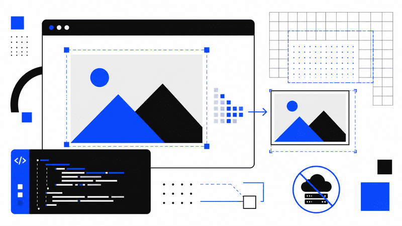

## Build a Private Image Resizer with JavaScript and Canvas



Image resizing sounds like a task that requires a backend service, an image-processing library, and
a place to store uploaded files.

For many applications, none of that is necessary.

Modern browsers can load an image, decode it, resize it, change its format, compress it, and
generate a downloadable file without sending a single byte to a server.

The entire process can run locally with JavaScript and the Canvas API.

This approach is especially useful for small developer tools, admin dashboards, profile image
editors, content management systems, and privacy-focused web applications. It removes server costs
while keeping the implementation relatively small.

In this guide, we will build a complete zero-server image resizer that supports:

- Local image selection
- Drag and drop
- Width and height controls
- Aspect ratio locking
- JPEG, PNG, and WebP output
- Adjustable compression quality
- Live image preview
- File size comparison
- Local file download

No framework is required. We will use standard HTML, CSS, and JavaScript.

## What Does Zero-Server Mean?

A zero-server image resizer processes files entirely inside the browser.

The selected image never needs to leave the user's device. JavaScript reads the local file, converts
it into a browser-compatible image object, draws it onto a canvas, and exports the result as a new
file.

The basic pipeline looks like this:

```text
Local image file
      ↓
File API
      ↓
Image decoding
      ↓
Canvas rendering
      ↓
Resize and compression
      ↓
Blob
      ↓
Local download
```

The browser acts as both the interface and the image-processing engine.

You can still host the application on a regular static platform such as GitHub Pages, Cloudflare
Pages, Netlify, or Vercel. The important detail is that the image itself is not uploaded to your
infrastructure.

## Why Build Image Processing in the Browser?

Client-side image resizing provides several practical benefits.

### Better privacy

Users do not have to upload personal images, screenshots, documents, or product photos to an unknown
server.

This is a meaningful advantage for privacy-sensitive tools.

### Lower infrastructure costs

Server-side image processing consumes CPU, memory, bandwidth, and storage. A browser-based tool
transfers that work to the user's device.

A static image resizer can operate without databases, file storage, queues, or background workers.

### Faster feedback

The browser can show the resized result immediately. There is no upload request, processing delay,
or download response.

Performance still depends on the image size and device, but common images usually process quickly.

### Easier deployment

The finished application contains only static files:

```text
index.html
styles.css
app.js
```

You can deploy it almost anywhere.

## The Browser APIs We Will Use

Several browser features work together to make local image resizing possible.

### File API

The File API gives JavaScript access to files selected through an `<input type="file">` element or
dropped into the browser.

A selected file contains useful information:

```js
console.log(file.name);
console.log(file.type);
console.log(file.size);
```

The browser does not expose the original filesystem path. It only provides controlled access to the
selected file.

### Object URLs

`URL.createObjectURL()` creates a temporary local URL that points to a `File` or `Blob`.

```js
const imageUrl = URL.createObjectURL(file);
```

This URL can be assigned to an image element:

```js
image.src = imageUrl;
```

Object URLs should be released when they are no longer needed:

```js
URL.revokeObjectURL(imageUrl);
```

This prevents unnecessary memory usage.

### Canvas API

A canvas gives us a pixel-based drawing surface.

The key operation is `drawImage()`:

```js
context.drawImage(sourceImage, 0, 0, targetWidth, targetHeight);
```

When the destination width and height differ from the original dimensions, the browser scales the
image while drawing it.

### Blob API

After rendering the image, `canvas.toBlob()` converts the canvas content into a downloadable binary
file.

```js
canvas.toBlob(
	(blob) => {
		console.log(blob);
	},
	'image/webp',
	0.85,
);
```

The third argument controls quality for formats such as JPEG and WebP.

## Project Structure

Create a new directory with three files:

```text
image-resizer/
├── index.html
├── styles.css
└── app.js
```

The application will remain framework-free so that the browser workflow stays easy to understand.

## Creating the HTML Interface

Start with the page structure.

```html
<!DOCTYPE html>
<html lang="en">
	<head>
		<meta charset="UTF-8" />
		<meta
			name="viewport"
			content="width=device-width, initial-scale=1" />
		<meta
			name="description"
			content="Resize and compress images locally in your browser." />
		<title>Zero-Server Image Resizer</title>
		<link
			rel="stylesheet"
			href="styles.css" />
	</head>
	<body>
		<main class="app">
			<header class="app__header">
				<p class="eyebrow">Browser Image Tool</p>
				<h1>Zero-Server Image Resizer</h1>
				<p class="intro"> Resize, convert, and compress images without uploading them. </p>
			</header>

			<section
				class="drop-zone"
				id="dropZone"
				tabindex="0"
				role="button"
				aria-label="Choose or drop an image">
				<input
					class="drop-zone__input"
					id="fileInput"
					type="file"
					accept="image/jpeg,image/png,image/webp" />

				<strong>Drop an image here</strong>
				<span>or click to choose a JPEG, PNG, or WebP file</span>
			</section>

			<p
				class="status"
				id="status"
				aria-live="polite">
				No image selected
			</p>

			<section
				class="workspace"
				id="workspace"
				hidden>
				<div class="preview-panel">
					<h2>Preview</h2>

					<div class="preview-frame">
						
					</div>

					<dl class="file-details">
						<div>
							<dt>Original</dt>
							<dd id="originalDetails">0 × 0, 0 KB</dd>
						</div>

						<div>
							<dt>Output</dt>
							<dd id="outputDetails">0 × 0, 0 KB</dd>
						</div>
					</dl>
				</div>

				<form
					class="controls"
					id="resizeForm">
					<h2>Resize settings</h2>

					<div class="field-row">
						<label class="field">
							<span>Width</span>
							<input
								id="widthInput"
								type="number"
								min="1"
								max="12000"
								required />
						</label>

						<label class="field">
							<span>Height</span>
							<input
								id="heightInput"
								type="number"
								min="1"
								max="12000"
								required />
						</label>
					</div>

					<label class="checkbox">
						<input
							id="aspectRatioInput"
							type="checkbox"
							checked />
						<span>Keep original aspect ratio</span>
					</label>

					<label class="field">
						<span>Output format</span>
						<select id="formatInput">
							<option value="image/jpeg">JPEG</option>
							<option value="image/png">PNG</option>
							<option
								value="image/webp"
								selected
								>WebP</option
							>
						</select>
					</label>

					<label
						class="field"
						id="qualityField">
						<span>
							Quality
							<output id="qualityOutput">85%</output>
						</span>

						<input
							id="qualityInput"
							type="range"
							min="10"
							max="100"
							value="85" />
					</label>

					<button
						class="button"
						type="submit">
						Resize image
					</button>

					<a
						class="button button--secondary"
						id="downloadButton"
						download
						hidden>
						Download resized image
					</a>
				</form>
			</section>

			<canvas
				id="canvas"
				hidden></canvas>
		</main>

		<script src="app.js"></script>
	</body>
</html>
```

The actual canvas is hidden because the preview will use a regular image element. Canvas remains our
internal processing surface.

The `aria-live` status element announces file and processing updates to assistive technologies.

## Adding the Styles

The design is intentionally simple. It keeps the upload area clear and gives the preview enough room
to display large images.

```css
:root {
	color-scheme: light dark;
	font-family:
		Inter,
		ui-sans-serif,
		system-ui,
		-apple-system,
		BlinkMacSystemFont,
		'Segoe UI',
		sans-serif;

	--background: #f4f4f0;
	--surface: #ffffff;
	--surface-muted: #eeeeea;
	--text: #181816;
	--text-muted: #66665f;
	--border: #c9c9c1;
	--accent: #181816;
	--accent-text: #ffffff;
	--radius: 18px;
}

* {
	box-sizing: border-box;
}

body {
	min-height: 100vh;
	margin: 0;
	background: var(--background);
	color: var(--text);
}

button,
input,
select {
	font: inherit;
}

.app {
	width: min(1100px, calc(100% - 32px));
	margin: 0 auto;
	padding: 64px 0;
}

.app__header {
	max-width: 680px;
	margin-bottom: 32px;
}

.eyebrow {
	margin: 0 0 10px;
	color: var(--text-muted);
	font-size: 0.78rem;
	font-weight: 700;
	letter-spacing: 0.12em;
	text-transform: uppercase;
}

h1,
h2,
p {
	margin-top: 0;
}

h1 {
	margin-bottom: 14px;
	font-size: clamp(2.25rem, 7vw, 5.5rem);
	line-height: 0.95;
	letter-spacing: -0.06em;
}

h2 {
	font-size: 1rem;
	letter-spacing: -0.02em;
}

.intro {
	max-width: 560px;
	margin-bottom: 0;
	color: var(--text-muted);
	font-size: 1.05rem;
	line-height: 1.6;
}

.drop-zone {
	display: grid;
	min-height: 220px;
	place-items: center;
	align-content: center;
	gap: 8px;
	padding: 32px;
	border: 2px dashed var(--border);
	border-radius: var(--radius);
	background: var(--surface);
	cursor: pointer;
	text-align: center;
	transition:
		border-color 160ms ease,
		transform 160ms ease;
}

.drop-zone:hover,
.drop-zone:focus-visible,
.drop-zone--active {
	border-color: var(--text);
	outline: none;
	transform: translateY(-2px);
}

.drop-zone__input {
	position: absolute;
	width: 1px;
	height: 1px;
	overflow: hidden;
	opacity: 0;
	pointer-events: none;
}

.drop-zone span {
	color: var(--text-muted);
}

.status {
	margin: 14px 4px 32px;
	color: var(--text-muted);
	font-size: 0.9rem;
}

.workspace {
	display: grid;
	grid-template-columns: minmax(0, 1.4fr) minmax(280px, 0.6fr);
	gap: 24px;
}

.preview-panel,
.controls {
	padding: 24px;
	border: 1px solid var(--border);
	border-radius: var(--radius);
	background: var(--surface);
}

.preview-frame {
	display: grid;
	min-height: 420px;
	place-items: center;
	overflow: hidden;
	border-radius: 12px;
	background:
		linear-gradient(45deg, var(--surface-muted) 25%, transparent 25%),
		linear-gradient(-45deg, var(--surface-muted) 25%, transparent 25%),
		linear-gradient(45deg, transparent 75%, var(--surface-muted) 75%),
		linear-gradient(-45deg, transparent 75%, var(--surface-muted) 75%);

	background-position:
		0 0,
		0 10px,
		10px -10px,
		-10px 0;
	background-size: 20px 20px;
}

.preview-frame img {
	display: block;
	max-width: 100%;
	max-height: 620px;
	object-fit: contain;
}

.file-details {
	display: grid;
	grid-template-columns: repeat(2, minmax(0, 1fr));
	gap: 16px;
	margin: 20px 0 0;
}

.file-details div {
	padding: 14px;
	border-radius: 10px;
	background: var(--surface-muted);
}

.file-details dt {
	margin-bottom: 5px;
	color: var(--text-muted);
	font-size: 0.75rem;
	text-transform: uppercase;
}

.file-details dd {
	margin: 0;
	font-size: 0.9rem;
	font-weight: 650;
}

.controls {
	align-self: start;
}

.field {
	display: grid;
	gap: 8px;
	margin-bottom: 18px;
}

.field > span {
	display: flex;
	justify-content: space-between;
	gap: 16px;
	font-size: 0.88rem;
	font-weight: 650;
}

.field-row {
	display: grid;
	grid-template-columns: repeat(2, minmax(0, 1fr));
	gap: 12px;
}

input,
select {
	width: 100%;
}

input[type='number'],
select {
	min-height: 46px;
	padding: 0 12px;
	border: 1px solid var(--border);
	border-radius: 9px;
	background: var(--surface);
	color: var(--text);
}

input:focus-visible,
select:focus-visible {
	border-color: var(--text);
	outline: 2px solid transparent;
}

.checkbox {
	display: flex;
	align-items: center;
	gap: 10px;
	margin: 0 0 22px;
	color: var(--text-muted);
	font-size: 0.9rem;
}

.checkbox input {
	width: auto;
}

.button {
	display: flex;
	width: 100%;
	min-height: 48px;
	align-items: center;
	justify-content: center;
	margin-top: 12px;
	border: 1px solid var(--accent);
	border-radius: 9px;
	background: var(--accent);
	color: var(--accent-text);
	cursor: pointer;
	font-weight: 700;
	text-decoration: none;
}

.button--secondary {
	background: transparent;
	color: var(--text);
}

@media (max-width: 800px) {
	.app {
		padding-top: 36px;
	}

	.workspace {
		grid-template-columns: 1fr;
	}

	.preview-frame {
		min-height: 300px;
	}
}

@media (prefers-color-scheme: dark) {
	:root {
		--background: #11110f;
		--surface: #1a1a17;
		--surface-muted: #242420;
		--text: #f5f5ee;
		--text-muted: #aaa99e;
		--border: #3a3a34;
		--accent: #f5f5ee;
		--accent-text: #11110f;
	}
}
```

The application now has a responsive layout, a visible drop zone, and a preview background that also
works with transparent PNG images.

## Connecting the DOM Elements

Open `app.js` and begin by collecting the interface elements.

```js
const fileInput = document.querySelector('#fileInput');
const dropZone = document.querySelector('#dropZone');
const workspace = document.querySelector('#workspace');
const status = document.querySelector('#status');

const previewImage = document.querySelector('#previewImage');
const originalDetails = document.querySelector('#originalDetails');
const outputDetails = document.querySelector('#outputDetails');

const resizeForm = document.querySelector('#resizeForm');
const widthInput = document.querySelector('#widthInput');
const heightInput = document.querySelector('#heightInput');
const aspectRatioInput = document.querySelector('#aspectRatioInput');
const formatInput = document.querySelector('#formatInput');

const qualityField = document.querySelector('#qualityField');
const qualityInput = document.querySelector('#qualityInput');
const qualityOutput = document.querySelector('#qualityOutput');

const canvas = document.querySelector('#canvas');
const downloadButton = document.querySelector('#downloadButton');
```

We also need a small amount of application state.

```js
let sourceFile = null;
let sourceImage = null;
let sourceUrl = '';
let outputUrl = '';
let aspectRatio = 1;
```

`sourceImage` will hold the decoded original image. The object URLs will be reused and revoked when
appropriate.

## Loading a Local Image

The first important function validates and loads a selected file.

```js
async function loadImageFile(file) {
	if (!file) {
		return;
	}

	if (!file.type.startsWith('image/')) {
		setStatus('Please choose a valid image file.', true);
		return;
	}

	const supportedTypes = ['image/jpeg', 'image/png', 'image/webp'];

	if (!supportedTypes.includes(file.type)) {
		setStatus('Only JPEG, PNG, and WebP files are supported.', true);
		return;
	}

	clearOutput();

	if (sourceUrl) {
		URL.revokeObjectURL(sourceUrl);
	}

	sourceFile = file;
	sourceUrl = URL.createObjectURL(file);

	try {
		sourceImage = await createImage(sourceUrl);
	} catch {
		setStatus('The browser could not decode this image.', true);
		resetSource();
		return;
	}

	aspectRatio = sourceImage.naturalWidth / sourceImage.naturalHeight;

	widthInput.value = sourceImage.naturalWidth;
	heightInput.value = sourceImage.naturalHeight;

	previewImage.src = sourceUrl;
	workspace.hidden = false;

	originalDetails.textContent = [
		`${sourceImage.naturalWidth} × ${sourceImage.naturalHeight}`,
		formatBytes(file.size),
	].join(', ');

	outputDetails.textContent = 'Not generated yet';

	setStatus(`Loaded ${file.name}`);
}
```

The helper that creates the image object returns a promise:

```js
function createImage(url) {
	return new Promise((resolve, reject) => {
		const image = new Image();

		image.onload = () => resolve(image);
		image.onerror = () => reject(new Error('Image decoding failed'));
		image.src = url;
	});
}
```

This keeps the asynchronous loading process easy to follow.

## Handling File Selection

When a user clicks the drop zone, we open the hidden file input.

```js
dropZone.addEventListener('click', () => {
	fileInput.click();
});
```

Keyboard users should be able to do the same with Enter or Space:

```js
dropZone.addEventListener('keydown', (event) => {
	if (event.key !== 'Enter' && event.key !== ' ') {
		return;
	}

	event.preventDefault();
	fileInput.click();
});
```

Listen for the input change:

```js
fileInput.addEventListener('change', (event) => {
	const [file] = event.target.files;
	loadImageFile(file);
});
```

Destructuring gives us the first selected file because this tool accepts only one image at a time.

## Adding Drag and Drop

Drag and drop requires several events.

```js
const dragEvents = ['dragenter', 'dragover', 'dragleave', 'drop'];

dragEvents.forEach((eventName) => {
	dropZone.addEventListener(eventName, (event) => {
		event.preventDefault();
		event.stopPropagation();
	});
});
```

Without `preventDefault()`, the browser may try to open the dropped image as a new page.

Next, update the visual state:

```js
['dragenter', 'dragover'].forEach((eventName) => {
	dropZone.addEventListener(eventName, () => {
		dropZone.classList.add('drop-zone--active');
	});
});

['dragleave', 'drop'].forEach((eventName) => {
	dropZone.addEventListener(eventName, () => {
		dropZone.classList.remove('drop-zone--active');
	});
});
```

Finally, read the dropped file:

```js
dropZone.addEventListener('drop', (event) => {
	const [file] = event.dataTransfer.files;
	loadImageFile(file);
});
```

The same `loadImageFile()` function now handles both interaction methods.

## Preserving the Aspect Ratio

Changing only one dimension can stretch the image. Most users expect the original proportions to
remain intact.

When the width changes, calculate the corresponding height:

```js
widthInput.addEventListener('input', () => {
	if (!aspectRatioInput.checked || !sourceImage) {
		return;
	}

	const width = Number(widthInput.value);

	if (!Number.isFinite(width) || width < 1) {
		return;
	}

	heightInput.value = Math.max(1, Math.round(width / aspectRatio));
});
```

Apply the reverse calculation when the height changes:

```js
heightInput.addEventListener('input', () => {
	if (!aspectRatioInput.checked || !sourceImage) {
		return;
	}

	const height = Number(heightInput.value);

	if (!Number.isFinite(height) || height < 1) {
		return;
	}

	widthInput.value = Math.max(1, Math.round(height * aspectRatio));
});
```

The ratio is based on the original decoded dimensions:

```js
aspectRatio = sourceImage.naturalWidth / sourceImage.naturalHeight;
```

Users can disable the checkbox when they deliberately need custom dimensions.

## Updating the Quality Control

PNG export does not use a lossy quality value in the same way as JPEG or WebP.

We can hide the quality field whenever PNG is selected.

```js
formatInput.addEventListener('change', () => {
	qualityField.hidden = formatInput.value === 'image/png';
	clearOutput();
});
```

Keep the displayed percentage synchronized with the slider:

```js
qualityInput.addEventListener('input', () => {
	qualityOutput.value = `${qualityInput.value}%`;
	clearOutput();
});
```

The slider value ranges from 10 to 100, while `canvas.toBlob()` expects a number between `0` and
`1`.

We will convert it during export.

## Resizing with Canvas

The central processing function draws the original image onto a canvas at the requested dimensions.

```js
async function resizeImage() {
	if (!sourceImage || !sourceFile) {
		throw new Error('Choose an image before resizing.');
	}

	const width = Number(widthInput.value);
	const height = Number(heightInput.value);

	validateDimensions(width, height);

	canvas.width = width;
	canvas.height = height;

	const context = canvas.getContext('2d');

	if (!context) {
		throw new Error('Canvas is not supported in this browser.');
	}

	context.clearRect(0, 0, width, height);
	context.imageSmoothingEnabled = true;
	context.imageSmoothingQuality = 'high';

	context.drawImage(sourceImage, 0, 0, width, height);

	const mimeType = formatInput.value;
	const quality = Number(qualityInput.value) / 100;

	return canvasToBlob(canvas, mimeType, quality);
}
```

Setting `imageSmoothingQuality` to `"high"` asks the browser to favor quality during scaling.

It remains a hint rather than a strict guarantee. Browsers may use different internal resizing
algorithms.

## Converting Canvas to a Blob

`canvas.toBlob()` uses a callback API. Wrapping it in a promise makes it easier to use with `async`
and `await`.

```js
function canvasToBlob(canvasElement, mimeType, quality) {
	return new Promise((resolve, reject) => {
		canvasElement.toBlob(
			(blob) => {
				if (!blob) {
					reject(new Error('The output image could not be created.'));
					return;
				}

				resolve(blob);
			},
			mimeType,
			quality,
		);
	});
}
```

For PNG files, browsers generally ignore the quality value. Passing it does not cause a problem, but
you could also omit it conditionally.

## Validating the Dimensions

Large canvas sizes can freeze a page or exceed browser memory limits. It is useful to define a
reasonable limit.

```js
function validateDimensions(width, height) {
	if (!Number.isInteger(width) || !Number.isInteger(height)) {
		throw new Error('Width and height must be whole numbers.');
	}

	if (width < 1 || height < 1) {
		throw new Error('Width and height must be greater than zero.');
	}

	const maximumDimension = 12000;

	if (width > maximumDimension || height > maximumDimension) {
		throw new Error(`Width and height cannot exceed ${maximumDimension} pixels.`);
	}

	const maximumPixels = 40_000_000;

	if (width * height > maximumPixels) {
		throw new Error('The selected dimensions create an image that is too large.');
	}
}
```

A 10,000 by 10,000 canvas contains 100 million pixels.

Raw RGBA data requires approximately four bytes per pixel, so that image could need around 400 MB
before accounting for additional browser overhead.

Limiting total pixels is more useful than checking width alone.

## Generating the Download

Connect the form submission to the resizing function.

```js
resizeForm.addEventListener('submit', async (event) => {
	event.preventDefault();

	downloadButton.hidden = true;
	setStatus('Processing image...');

	try {
		const blob = await resizeImage();
		showOutput(blob);
	} catch (error) {
		const message = error instanceof Error ? error.message : 'Image processing failed.';

		setStatus(message, true);
	}
});
```

The `showOutput()` function creates a new object URL and updates the interface:

```js
function showOutput(blob) {
	if (outputUrl) {
		URL.revokeObjectURL(outputUrl);
	}

	outputUrl = URL.createObjectURL(blob);

	previewImage.src = outputUrl;
	downloadButton.href = outputUrl;
	downloadButton.download = createOutputName(sourceFile.name, formatInput.value);

	downloadButton.hidden = false;

	outputDetails.textContent = [`${canvas.width} × ${canvas.height}`, formatBytes(blob.size)].join(
		', ',
	);

	setStatus('The resized image is ready.');
}
```

The blob remains local. Assigning its object URL to an anchor element lets the browser download it
as a regular file.

## Creating a Useful Filename

A generated file should preserve the original name while adding a clear suffix.

```js
function createOutputName(originalName, mimeType) {
	const baseName = originalName.replace(/\.[^/.]+$/, '');

	const extensions = {
		'image/jpeg': 'jpg',
		'image/png': 'png',
		'image/webp': 'webp',
	};

	const extension = extensions[mimeType] ?? 'png';

	return `${baseName}-${canvas.width}x${canvas.height}.${extension}`;
}
```

An input named `mountains.png` resized to 1200 by 800 pixels might become:

```text
mountains-1200x800.webp
```

This makes downloaded results easier to identify.

## Formatting File Sizes

File sizes are easier to read as KB or MB than as raw bytes.

```js
function formatBytes(bytes) {
	if (bytes === 0) {
		return '0 B';
	}

	const units = ['B', 'KB', 'MB', 'GB'];
	const unitIndex = Math.min(Math.floor(Math.log(bytes) / Math.log(1024)), units.length - 1);

	const value = bytes / 1024 ** unitIndex;
	const fractionDigits = unitIndex === 0 ? 0 : 1;

	return `${value.toFixed(fractionDigits)} ${units[unitIndex]}`;
}
```

The interface can now show a simple comparison:

```text
Original: 4032 × 3024, 5.8 MB
Output: 1200 × 900, 214.6 KB
```

Compression results vary according to image content, output dimensions, format, and quality.

## Clearing Stale Results

A previously generated download should not remain active after the user changes the settings.

```js
function clearOutput() {
	if (outputUrl) {
		URL.revokeObjectURL(outputUrl);
		outputUrl = '';
	}

	downloadButton.hidden = true;

	if (sourceUrl && sourceImage) {
		previewImage.src = sourceUrl;
	}

	if (sourceImage) {
		outputDetails.textContent = 'Not generated yet';
	}
}
```

Call it whenever dimensions change:

```js
widthInput.addEventListener('change', clearOutput);
heightInput.addEventListener('change', clearOutput);
aspectRatioInput.addEventListener('change', clearOutput);
```

This prevents users from downloading an older result after editing the requested dimensions.

## Status and Reset Helpers

Add two small utility functions:

```js
function setStatus(message, isError = false) {
	status.textContent = message;
	status.dataset.state = isError ? 'error' : 'normal';
}

function resetSource() {
	sourceFile = null;
	sourceImage = null;
	workspace.hidden = true;

	if (sourceUrl) {
		URL.revokeObjectURL(sourceUrl);
		sourceUrl = '';
	}

	clearOutput();
}
```

You can style error states separately:

```css
.status[data-state='error'] {
	color: #b42318;
}
```

For dark mode, a lighter error color may improve contrast:

```css
@media (prefers-color-scheme: dark) {
	.status[data-state='error'] {
		color: #ff8d85;
	}
}
```

## Releasing Memory When the Page Closes

Object URLs can hold browser resources for as long as they exist.

Clean them up when the document is unloaded:

```js
window.addEventListener('beforeunload', () => {
	if (sourceUrl) {
		URL.revokeObjectURL(sourceUrl);
	}

	if (outputUrl) {
		URL.revokeObjectURL(outputUrl);
	}
});
```

This is particularly useful when users repeatedly process large files.

## Complete JavaScript File

Here is the complete `app.js` implementation:

```js
const fileInput = document.querySelector('#fileInput');
const dropZone = document.querySelector('#dropZone');
const workspace = document.querySelector('#workspace');
const status = document.querySelector('#status');

const previewImage = document.querySelector('#previewImage');
const originalDetails = document.querySelector('#originalDetails');
const outputDetails = document.querySelector('#outputDetails');

const resizeForm = document.querySelector('#resizeForm');
const widthInput = document.querySelector('#widthInput');
const heightInput = document.querySelector('#heightInput');
const aspectRatioInput = document.querySelector('#aspectRatioInput');
const formatInput = document.querySelector('#formatInput');

const qualityField = document.querySelector('#qualityField');
const qualityInput = document.querySelector('#qualityInput');
const qualityOutput = document.querySelector('#qualityOutput');

const canvas = document.querySelector('#canvas');
const downloadButton = document.querySelector('#downloadButton');

let sourceFile = null;
let sourceImage = null;
let sourceUrl = '';
let outputUrl = '';
let aspectRatio = 1;

async function loadImageFile(file) {
	if (!file) {
		return;
	}

	const supportedTypes = ['image/jpeg', 'image/png', 'image/webp'];

	if (!supportedTypes.includes(file.type)) {
		setStatus('Only JPEG, PNG, and WebP files are supported.', true);
		return;
	}

	clearOutput();

	if (sourceUrl) {
		URL.revokeObjectURL(sourceUrl);
	}

	sourceFile = file;
	sourceUrl = URL.createObjectURL(file);

	try {
		sourceImage = await createImage(sourceUrl);
	} catch {
		setStatus('The browser could not decode this image.', true);
		resetSource();
		return;
	}

	aspectRatio = sourceImage.naturalWidth / sourceImage.naturalHeight;

	widthInput.value = sourceImage.naturalWidth;
	heightInput.value = sourceImage.naturalHeight;

	previewImage.src = sourceUrl;
	workspace.hidden = false;

	originalDetails.textContent = [
		`${sourceImage.naturalWidth} × ${sourceImage.naturalHeight}`,
		formatBytes(file.size),
	].join(', ');

	outputDetails.textContent = 'Not generated yet';
	setStatus(`Loaded ${file.name}`);
}

function createImage(url) {
	return new Promise((resolve, reject) => {
		const image = new Image();

		image.onload = () => resolve(image);
		image.onerror = () => reject(new Error('Image decoding failed'));
		image.src = url;
	});
}

async function resizeImage() {
	if (!sourceImage || !sourceFile) {
		throw new Error('Choose an image before resizing.');
	}

	const width = Number(widthInput.value);
	const height = Number(heightInput.value);

	validateDimensions(width, height);

	canvas.width = width;
	canvas.height = height;

	const context = canvas.getContext('2d');

	if (!context) {
		throw new Error('Canvas is not supported in this browser.');
	}

	context.clearRect(0, 0, width, height);
	context.imageSmoothingEnabled = true;
	context.imageSmoothingQuality = 'high';

	context.drawImage(sourceImage, 0, 0, width, height);

	const mimeType = formatInput.value;
	const quality = Number(qualityInput.value) / 100;

	return canvasToBlob(canvas, mimeType, quality);
}

function canvasToBlob(canvasElement, mimeType, quality) {
	return new Promise((resolve, reject) => {
		canvasElement.toBlob(
			(blob) => {
				if (!blob) {
					reject(new Error('The output image could not be created.'));
					return;
				}

				resolve(blob);
			},
			mimeType,
			quality,
		);
	});
}

function validateDimensions(width, height) {
	if (!Number.isInteger(width) || !Number.isInteger(height)) {
		throw new Error('Width and height must be whole numbers.');
	}

	if (width < 1 || height < 1) {
		throw new Error('Width and height must be greater than zero.');
	}

	const maximumDimension = 12000;

	if (width > maximumDimension || height > maximumDimension) {
		throw new Error(`Width and height cannot exceed ${maximumDimension} pixels.`);
	}

	const maximumPixels = 40_000_000;

	if (width * height > maximumPixels) {
		throw new Error('The selected dimensions create an image that is too large.');
	}
}

function showOutput(blob) {
	if (outputUrl) {
		URL.revokeObjectURL(outputUrl);
	}

	outputUrl = URL.createObjectURL(blob);

	previewImage.src = outputUrl;
	downloadButton.href = outputUrl;
	downloadButton.download = createOutputName(sourceFile.name, formatInput.value);

	downloadButton.hidden = false;

	outputDetails.textContent = [`${canvas.width} × ${canvas.height}`, formatBytes(blob.size)].join(
		', ',
	);

	setStatus('The resized image is ready.');
}

function createOutputName(originalName, mimeType) {
	const baseName = originalName.replace(/\.[^/.]+$/, '');

	const extensions = {
		'image/jpeg': 'jpg',
		'image/png': 'png',
		'image/webp': 'webp',
	};

	const extension = extensions[mimeType] ?? 'png';

	return `${baseName}-${canvas.width}x${canvas.height}.${extension}`;
}

function formatBytes(bytes) {
	if (bytes === 0) {
		return '0 B';
	}

	const units = ['B', 'KB', 'MB', 'GB'];

	const unitIndex = Math.min(Math.floor(Math.log(bytes) / Math.log(1024)), units.length - 1);

	const value = bytes / 1024 ** unitIndex;
	const fractionDigits = unitIndex === 0 ? 0 : 1;

	return `${value.toFixed(fractionDigits)} ${units[unitIndex]}`;
}

function clearOutput() {
	if (outputUrl) {
		URL.revokeObjectURL(outputUrl);
		outputUrl = '';
	}

	downloadButton.hidden = true;

	if (sourceUrl && sourceImage) {
		previewImage.src = sourceUrl;
	}

	if (sourceImage) {
		outputDetails.textContent = 'Not generated yet';
	}
}

function setStatus(message, isError = false) {
	status.textContent = message;
	status.dataset.state = isError ? 'error' : 'normal';
}

function resetSource() {
	sourceFile = null;
	sourceImage = null;
	workspace.hidden = true;

	if (sourceUrl) {
		URL.revokeObjectURL(sourceUrl);
		sourceUrl = '';
	}

	clearOutput();
}

dropZone.addEventListener('click', () => {
	fileInput.click();
});

dropZone.addEventListener('keydown', (event) => {
	if (event.key !== 'Enter' && event.key !== ' ') {
		return;
	}

	event.preventDefault();
	fileInput.click();
});

fileInput.addEventListener('change', (event) => {
	const [file] = event.target.files;
	loadImageFile(file);
});

const dragEvents = ['dragenter', 'dragover', 'dragleave', 'drop'];

dragEvents.forEach((eventName) => {
	dropZone.addEventListener(eventName, (event) => {
		event.preventDefault();
		event.stopPropagation();
	});
});

['dragenter', 'dragover'].forEach((eventName) => {
	dropZone.addEventListener(eventName, () => {
		dropZone.classList.add('drop-zone--active');
	});
});

['dragleave', 'drop'].forEach((eventName) => {
	dropZone.addEventListener(eventName, () => {
		dropZone.classList.remove('drop-zone--active');
	});
});

dropZone.addEventListener('drop', (event) => {
	const [file] = event.dataTransfer.files;
	loadImageFile(file);
});

widthInput.addEventListener('input', () => {
	if (!aspectRatioInput.checked || !sourceImage) {
		return;
	}

	const width = Number(widthInput.value);

	if (!Number.isFinite(width) || width < 1) {
		return;
	}

	heightInput.value = Math.max(1, Math.round(width / aspectRatio));
});

heightInput.addEventListener('input', () => {
	if (!aspectRatioInput.checked || !sourceImage) {
		return;
	}

	const height = Number(heightInput.value);

	if (!Number.isFinite(height) || height < 1) {
		return;
	}

	widthInput.value = Math.max(1, Math.round(height * aspectRatio));
});

formatInput.addEventListener('change', () => {
	qualityField.hidden = formatInput.value === 'image/png';
	clearOutput();
});

qualityInput.addEventListener('input', () => {
	qualityOutput.value = `${qualityInput.value}%`;
	clearOutput();
});

widthInput.addEventListener('change', clearOutput);
heightInput.addEventListener('change', clearOutput);
aspectRatioInput.addEventListener('change', clearOutput);

resizeForm.addEventListener('submit', async (event) => {
	event.preventDefault();

	downloadButton.hidden = true;
	setStatus('Processing image...');

	try {
		const blob = await resizeImage();
		showOutput(blob);
	} catch (error) {
		const message = error instanceof Error ? error.message : 'Image processing failed.';

		setStatus(message, true);
	}
});

window.addEventListener('beforeunload', () => {
	if (sourceUrl) {
		URL.revokeObjectURL(sourceUrl);
	}

	if (outputUrl) {
		URL.revokeObjectURL(outputUrl);
	}
});
```

## Handling Transparent Images

PNG and WebP files can contain transparent pixels. Canvas preserves that transparency when exporting
to another format that supports it.

JPEG does not support transparency.

If a transparent image is exported as JPEG, transparent areas may become black or another
browser-dependent color. To avoid this, fill the canvas with a background before drawing the image.

```js
if (mimeType === 'image/jpeg') {
	context.fillStyle = '#ffffff';
	context.fillRect(0, 0, width, height);
}

context.drawImage(sourceImage, 0, 0, width, height);
```

Place this code after `clearRect()` and before `drawImage()`.

You could also add a background color picker to the interface and let users choose how transparent
pixels should be converted.

## Working with Image Orientation

Images captured by phones may include EXIF orientation metadata. The stored pixel data and the
intended visual orientation are not always identical.

Modern browsers often apply this metadata during decoding, but behavior can depend on the decoding
method and browser version.

One alternative is `createImageBitmap()`:

```js
const bitmap = await createImageBitmap(file, {
	imageOrientation: 'from-image',
});
```

The bitmap can be drawn directly:

```js
context.drawImage(bitmap, 0, 0, targetWidth, targetHeight);
```

Remember to release it after processing:

```js
bitmap.close();
```

For a production image tool, test photos from several mobile devices before deciding whether regular
`Image` decoding is sufficient.

## Improving Resize Quality

A single canvas operation is usually adequate when the target is close to the original size.

Large reductions can sometimes look softer than expected. For example, shrinking a 6000-pixel image
directly to 300 pixels asks the browser to discard a considerable amount of information in one step.

Progressive resizing reduces the image in stages.

```js
function drawProgressively(source, finalCanvas, targetWidth, targetHeight) {
	let currentSource = source;
	let currentWidth = source.naturalWidth;
	let currentHeight = source.naturalHeight;

	while (currentWidth / 2 > targetWidth && currentHeight / 2 > targetHeight) {
		const temporaryCanvas = document.createElement('canvas');
		const temporaryContext = temporaryCanvas.getContext('2d');

		currentWidth = Math.max(targetWidth, Math.round(currentWidth / 2));

		currentHeight = Math.max(targetHeight, Math.round(currentHeight / 2));

		temporaryCanvas.width = currentWidth;
		temporaryCanvas.height = currentHeight;

		temporaryContext.imageSmoothingEnabled = true;
		temporaryContext.imageSmoothingQuality = 'high';

		temporaryContext.drawImage(currentSource, 0, 0, currentWidth, currentHeight);

		currentSource = temporaryCanvas;
	}

	const finalContext = finalCanvas.getContext('2d');

	finalContext.imageSmoothingEnabled = true;
	finalContext.imageSmoothingQuality = 'high';

	finalContext.drawImage(currentSource, 0, 0, targetWidth, targetHeight);
}
```

Progressive resizing adds more work and memory usage. It is most useful when users regularly create
thumbnails from very large source images.

For a lightweight utility, direct resizing is a reasonable default.

## Resizing Versus Cropping

Our current implementation stretches the source image to exactly match the target width and height.

When aspect ratio locking is enabled, this produces a regular proportional resize. If users disable
the lock and enter different proportions, the result becomes distorted.

Another option is to crop the image so that it fills the target area without stretching.

A basic cover calculation looks like this:

```js
function drawImageCover(context, image, targetWidth, targetHeight) {
	const sourceWidth = image.naturalWidth;
	const sourceHeight = image.naturalHeight;

	const scale = Math.max(targetWidth / sourceWidth, targetHeight / sourceHeight);

	const drawnWidth = sourceWidth * scale;
	const drawnHeight = sourceHeight * scale;

	const offsetX = (targetWidth - drawnWidth) / 2;
	const offsetY = (targetHeight - drawnHeight) / 2;

	context.drawImage(image, offsetX, offsetY, drawnWidth, drawnHeight);
}
```

This behaves similarly to:

```css
object-fit: cover;
```

Parts of the image may be cut off, but the visible content will not be distorted.

A production tool could provide three modes:

```text
Fit
Fill
Stretch
```

Each mode serves a different use case.

## Choosing the Right Output Format

The selected format can affect file size more than the quality slider.

### JPEG

JPEG works well for photographs, screenshots with many colors, and images without transparency.

It uses lossy compression, which means some visual information is discarded.

A quality between `0.75` and `0.9` is usually a practical starting point.

### PNG

PNG is useful for interface graphics, diagrams, logos, and images that require transparency.

It uses lossless compression, so the output can be considerably larger than JPEG or WebP.

Changing the canvas quality value does not normally reduce PNG size.

### WebP

WebP supports transparency and efficient lossy compression. It is a useful default for browser-based
tools.

A WebP file often becomes smaller than a comparable JPEG while preserving similar visual quality,
though results depend on the image.

For maximum compatibility with external software, users may still prefer JPEG or PNG.

## Avoiding Common Canvas Problems

The Canvas API is approachable, but image tools quickly encounter edge cases.

### Trying to process enormous images

A large image may decode successfully and still exceed the practical canvas limit.

Check both dimensions and total pixel count before allocating the output canvas.

### Forgetting to revoke object URLs

Repeatedly creating preview URLs without releasing them increases memory usage.

Revoke old URLs whenever the selected image or generated output changes.

### Using `toDataURL()` for large images

`canvas.toDataURL()` returns a base64 string.

```js
const dataUrl = canvas.toDataURL('image/jpeg', 0.85);
```

This is convenient for small previews but inefficient for large files. Base64 increases the
representation size and creates large strings in memory.

For downloads, `toBlob()` is the better choice.

### Assuming quality works for every format

The quality argument matters for lossy formats such as JPEG and WebP.

It does not provide the same control for PNG output.

### Resizing repeatedly from the previous output

Always resize from the original decoded image.

If each new operation uses an already compressed result, visual artifacts accumulate and quality
gradually declines.

### Blocking the main thread

Large images can make the page briefly unresponsive because canvas drawing and encoding usually
happen on the main thread.

For occasional processing, this may be acceptable. A batch-oriented tool should consider workers and
`OffscreenCanvas`.

## Moving Processing to a Web Worker

The basic application is sufficient for one image at a time. More demanding tools can move canvas
work away from the interface thread.

`OffscreenCanvas` allows canvas rendering inside a worker in supported environments.

A simplified worker might look like this:

```js
self.addEventListener('message', async (event) => {
	const { bitmap, width, height, mimeType, quality } = event.data;

	const canvas = new OffscreenCanvas(width, height);
	const context = canvas.getContext('2d');

	context.imageSmoothingEnabled = true;
	context.imageSmoothingQuality = 'high';
	context.drawImage(bitmap, 0, 0, width, height);

	const blob = await canvas.convertToBlob({
		type: mimeType,
		quality,
	});

	bitmap.close();

	self.postMessage({ blob });
});
```

The main thread creates the bitmap and transfers it:

```js
const bitmap = await createImageBitmap(file);

worker.postMessage(
	{
		bitmap,
		width: 1200,
		height: 800,
		mimeType: 'image/webp',
		quality: 0.85,
	},
	[bitmap],
);
```

This architecture is useful for batch conversion, thumbnail generation, and tools that need to keep
controls responsive during processing.

It also adds complexity, so it should be introduced only when the simpler implementation becomes a
real limitation.

## Privacy Claims Should Be Precise

A local image tool can honestly state that images are processed in the browser.

That claim should match the rest of the application.

Analytics scripts, error-reporting services, advertising platforms, or logging tools might still
collect page metadata. They should not receive the image unless the application explicitly sends it,
but vague privacy language can still mislead users.

A clear message is better:

```text
Your image is processed locally in this browser.
The file is not uploaded to our server.
```

You can also verify the behavior using the browser's Network panel. Selecting and resizing an image
should not produce a file upload request.

## Security Considerations

Local processing reduces server risk, but it does not remove every concern.

Treat selected files as untrusted input. The browser decoder provides an important security
boundary, which is one reason to avoid parsing complex image formats manually.

Do not inject filenames into `innerHTML`.

Use:

```js
fileNameElement.textContent = file.name;
```

Avoid:

```js
fileNameElement.innerHTML = file.name;
```

The second version can turn a malicious filename into HTML.

It is also wise to enforce file size and pixel limits before expensive processing.

```js
const maximumFileSize = 25 * 1024 * 1024;

if (file.size > maximumFileSize) {
	throw new Error('The selected file is larger than 25 MB.');
}
```

File size alone does not reveal decoded memory usage, which is why dimensional checks remain
important.

## Useful Features to Add Next

The simple project can grow into a capable image utility.

Possible improvements include:

- Multiple image processing
- Batch ZIP downloads
- Preset dimensions
- Percentage-based resizing
- Maximum width and height mode
- Crop positioning
- Rotation and flipping
- Background color controls
- Metadata removal
- Before-and-after comparison
- Clipboard paste support
- Clipboard copy for the output
- AVIF export where supported
- Saved user settings
- Progressive resizing
- Worker-based processing

A preset system is particularly useful for repetitive work:

```js
const presets = {
	avatar: {
		width: 512,
		height: 512,
		mode: 'cover',
	},
	articleCover: {
		width: 1600,
		height: 900,
		mode: 'cover',
	},
	socialPreview: {
		width: 1200,
		height: 630,
		mode: 'cover',
	},
};
```

Users can choose a purpose instead of remembering exact pixel dimensions.

## Testing the Resizer

Image tools should be tested with more than one clean JPEG.

Use a small collection of files that cover different cases:

```text
Large phone photo
Transparent PNG logo
Wide landscape image
Tall portrait image
Small low-resolution image
WebP photograph
Image with spaces in its filename
Image with non-Latin characters in its filename
```

Check the following behaviors:

- Aspect ratio remains correct
- Transparent pixels survive PNG and WebP export
- JPEG receives the expected background
- The reported output size matches the blob size
- Downloaded extensions match the selected format
- Old download URLs are cleared
- Invalid files produce readable errors
- Oversized dimensions are rejected
- Drag and drop works
- Keyboard file selection remains accessible

Testing on mobile devices is also valuable because memory limits are often lower than on desktop
systems.

## Deploying the Application

Because the project is fully static, deployment is straightforward.

You can upload the three files to any static hosting service.

For GitHub Pages, commit the project to a repository and enable Pages for the main branch.

For Cloudflare Pages or Netlify, connect the repository and publish the project root. No build
command is required.

The deployed page may run from a global CDN, but selected images still remain inside the user's
browser unless your JavaScript explicitly uploads them.

## When a Server Is Still Necessary

Client-side processing is not the right answer for every application.

A server may still be required when you need:

- Permanent image storage
- Shared image URLs
- Social network preview generation
- Consistent output across all browsers
- Very large image processing
- Specialized codecs
- Automatic image optimization pipelines
- Access control
- Content moderation
- Centralized metadata extraction
- Processing that continues after the page closes

A useful architecture can combine both approaches.

Resize the image locally first, then upload the smaller result. This reduces transfer time and
server processing while still supporting permanent storage.

## Final Thoughts

The browser is no longer limited to displaying images. It can decode, transform, compress, preview,
and export them with a relatively small amount of JavaScript.

The File API provides access to the selected image. Canvas handles pixel transformation. Blob URLs
connect the generated result to the preview and download interface.

Together, these APIs are enough to build a useful image resizer without an upload endpoint,
processing server, database, or storage bucket.

The result is cheaper to operate, faster for many common files, and easier to explain from a privacy
perspective.

More importantly, the same foundation can support a much broader set of local image tools. Croppers,
converters, thumbnail generators, watermark tools, and compression utilities all begin with nearly
the same browser pipeline.
