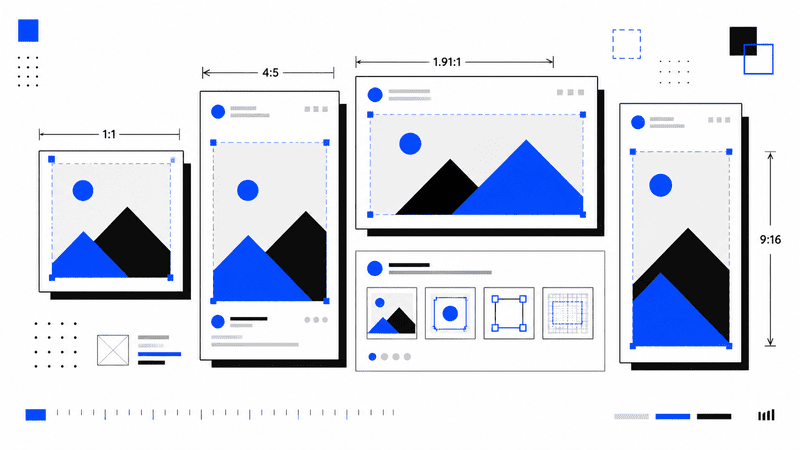

Creating an image for social media should be simple.

In practice, every platform has its own preferred dimensions, aspect ratios, cropping rules, and
interface overlays. An image that looks perfect on LinkedIn may lose its headline on Instagram. A
vertical design made for Stories can appear awkward when reused as a regular feed post.

The good news is that you do not need a separate design system for every network.

Most social media content now fits into a small group of reusable formats: square, portrait,
landscape, and full-screen vertical. Once you understand those formats, preparing images becomes
much easier.

This quick guide covers the recommended social media image sizes for Instagram, Facebook, LinkedIn,
X, YouTube, TikTok, Pinterest, and Threads.

Platform specifications change over time, so treat these dimensions as practical working
recommendations rather than permanent rules.

## Social Media Image Sizes at a Glance

| Platform  |        Content type | Recommended size | Aspect ratio |
| --------- | ------------------: | ---------------: | -----------: |
| Instagram |    Square feed post |   1080 × 1080 px |          1:1 |
| Instagram |  Portrait feed post |   1080 × 1350 px |          4:5 |
| Instagram | Landscape feed post |    1080 × 566 px |       1.91:1 |
| Instagram |       Story or Reel |   1080 × 1920 px |         9:16 |
| Facebook  |   Square feed image |   1080 × 1080 px |          1:1 |
| Facebook  | Portrait feed image |   1440 × 1800 px |          4:5 |
| Facebook  |       Story or Reel |   1080 × 1920 px |         9:16 |
| LinkedIn  |         Square post |   1200 × 1200 px |          1:1 |
| LinkedIn  |      Landscape post |    1200 × 627 px |       1.91:1 |
| X         |        Square image |   1200 × 1200 px |          1:1 |
| X         |     Landscape image |    1200 × 628 px |       1.91:1 |
| YouTube   |     Video thumbnail |    1280 × 720 px |         16:9 |
| YouTube   |      Channel banner |   2560 × 1440 px |         16:9 |
| TikTok    |    Full-screen post |   1080 × 1920 px |         9:16 |
| Pinterest |        Standard Pin |   1000 × 1500 px |          2:3 |
| Pinterest |     Full-screen Pin |   1080 × 1920 px |         9:16 |
| Threads   |       Portrait post |   1080 × 1350 px |          4:5 |

These dimensions provide enough resolution for modern screens while remaining manageable for
exporting and uploading.

## The Four Sizes Worth Remembering

You can cover most platforms with four master templates.

### Square

```text
1080 × 1080 px
1:1
```

Square images remain useful for carousels, product graphics, announcements, logos, and content that
may be shared across several networks.

They work well on Instagram, Facebook, LinkedIn, X, and Threads.

Square posts are easy to reuse, but they occupy less vertical space on a mobile screen than portrait
content.

### Portrait

```text
1080 × 1350 px
4:5
```

The 4:5 format is one of the most useful sizes for mobile feeds.

It fills more of the screen than a square image without becoming as tall as a Story. It is
particularly effective for Instagram and Facebook feed posts, but it can also work on LinkedIn and
Threads.

Meta supports both 1:1 and 4:5 content in feed placements and recommends vertical 4:5 for many
single-image ads.

### Landscape

```text
1200 × 628 px
1.91:1
```

Landscape images are common for link previews, sponsored content, blog promotions, and news-style
posts.

This format works especially well on LinkedIn and X. LinkedIn recommends a 1.91:1 ratio, commonly
exported at approximately 1200 × 627 or 1200 × 628 pixels.

Landscape graphics have less visual presence in a mobile feed, so keep the message direct and avoid
small text.

### Full-Screen Vertical

```text
1080 × 1920 px
9:16
```

This is the standard working size for Stories, Reels, TikTok videos, vertical ads, and other
full-screen content.

It is the most important format for short-form mobile video.

Do not place essential text directly against the top or bottom edges. Platform controls, captions,
usernames, buttons, and navigation elements frequently cover those areas.

## Instagram Image Sizes

Instagram supports several image proportions, but the strongest choices remain square, portrait, and
full-screen vertical.

### Instagram Feed Posts

Recommended dimensions:

```text
Square:     1080 × 1080 px
Portrait:   1080 × 1350 px
Landscape:  1080 × 566 px
```

The portrait 4:5 format is usually the strongest option for a single feed image because it occupies
more mobile screen space.

Square remains a safe choice for carousel posts, especially when you want every slide to use the
same reusable template.

Landscape is better suited to wide photography, product interfaces, dashboards, or scenes that
cannot be cropped vertically.

Current Instagram sizing guidance commonly recommends 1080 × 1350 pixels for portrait feed images
and 1080 × 1920 pixels for Stories and Reels.

### Instagram Stories

Recommended size:

```text
1080 × 1920 px
9:16
```

Stories display vertically and use the entire phone screen.

Keep important text and logos away from the extreme top and bottom. The profile header appears near
the top, while reply controls and other interface elements occupy the lower part of the screen.

A reasonable design safe area is the central portion of the canvas.

### Instagram Reels

Recommended size:

```text
1080 × 1920 px
9:16
```

Reels use the same full-screen ratio as Stories, but the interface is more crowded.

Captions, engagement buttons, audio information, and profile details can cover parts of the frame.
Keep faces, product details, headings, and calls to action closer to the center.

Reel covers also need additional care because their previews may be cropped differently inside the
profile grid.

## Facebook Image Sizes

Facebook supports many placements, but most regular content can be prepared in three formats.

### Facebook Feed Images

Recommended dimensions:

```text
Square:    1080 × 1080 px
Portrait:  1440 × 1800 px
Landscape: 1200 × 628 px
```

Meta recommends 1:1 and 4:5 ratios for feed placements. For vertical feed images, 4:5 is generally
the most space-efficient choice.

A 1080 × 1350 image also uses the same 4:5 ratio and is often easier to reuse on Instagram.

The larger 1440 × 1800 version simply provides more source resolution.

### Facebook Stories and Reels

Recommended size:

```text
1080 × 1920 px
9:16
```

Design these images for vertical viewing from the beginning.

Avoid placing a desktop banner inside a vertical canvas with large empty areas. Crop or rearrange
the content so that the composition feels native to a phone screen.

### Facebook Link Images

Recommended size:

```text
1200 × 628 px
1.91:1
```

This format is useful for article previews, product pages, landing pages, and other shared links.

Keep headlines short. Link cards may be displayed at smaller sizes, particularly on mobile devices.

## LinkedIn Image Sizes

LinkedIn is more flexible than it once was, but landscape and square images remain the most reliable
formats.

### LinkedIn Landscape Posts

Recommended size:

```text
1200 × 627 px
1.91:1
```

This is a strong choice for blog articles, company updates, product announcements, reports, and
shared links.

LinkedIn officially recommends a 1.91:1 ratio for custom Page post images connected to URLs. Images
should be wider than 200 pixels, while PNG and JPEG are supported for Page imagery.

### LinkedIn Square Posts

Recommended size:

```text
1200 × 1200 px
1:1
```

Square images are useful when the image itself carries the main message.

LinkedIn recommends 1200 × 1200 pixels for square single-image advertising across desktop and mobile
placements.

Square also works well for charts, quotes, product features, and carousel-style document covers.

### LinkedIn Portrait Posts

Recommended size:

```text
1080 × 1350 px
4:5
```

Portrait images can perform well in the mobile feed because they receive more vertical space.

However, LinkedIn interfaces vary between desktop and mobile. Place important content near the
center and preview the post before publishing.

### LinkedIn Profile and Page Images

Common working sizes:

```text
Personal profile photo:  400 × 400 px
Personal background:     1584 × 396 px
Company logo:            300 × 300 px or larger
```

Profile and company images are often displayed at much smaller sizes than their uploaded dimensions.

Use a simple logo, clear silhouette, or tightly framed portrait. Fine text will become unreadable.

## X Image Sizes

X supports several ratios, including square, landscape, portrait, and vertical formats.

### X Square Images

Recommended size:

```text
1200 × 1200 px
1:1
```

Square images are suitable for regular graphics, product posts, charts, promotional cards, and
announcements.

X officially recommends 1200 × 1200 pixels for standalone square image ads.

### X Landscape Images

Recommended size:

```text
1200 × 628 px
1.91:1
```

This is a practical choice for article previews, screenshots, wide illustrations, and campaign
graphics.

X lists 1200 × 628 pixels as the recommended size for standalone landscape image ads.

### X Portrait Images

Useful ratios include:

```text
1080 × 1350 px
4:5
```

and:

```text
1080 × 1620 px
2:3
```

X supports expanded vertical ratios, including 4:5 and 2:3, alongside square, landscape, and
full-screen vertical formats.

Portrait images can attract more attention on mobile, though the exact preview can depend on the
post layout and number of attached images.

## YouTube Image Sizes

YouTube relies heavily on two important image formats: video thumbnails and channel banners.

### YouTube Video Thumbnails

Recommended size:

```text
1280 × 720 px
16:9
```

The thumbnail is often seen at a small size, so clarity matters more than detail.

Use one dominant subject, strong contrast, and very little text. A thumbnail with five small objects
and a full sentence may look acceptable in an editor but become unreadable in search results.

YouTube uses 1280 × 720 pixels as the standard 720p thumbnail reference. Its thumbnail testing
feature also treats images below that resolution differently.

### YouTube Channel Banners

Recommended size:

```text
2560 × 1440 px
16:9
```

YouTube recommends a banner image of at least 2560 × 1440 pixels for consistent display across
devices.

The full banner is not visible everywhere.

Televisions may display most of the canvas, while desktop and mobile layouts show a narrower central
section. Place the channel name, tagline, and essential graphics in the middle rather than near the
outer edges.

### YouTube Profile Pictures

Recommended working size:

```text
800 × 800 px
1:1
```

The final image is displayed as a circle.

Keep important details away from the corners and avoid thin typography.

## TikTok Image and Video Sizes

TikTok is designed around vertical mobile content.

### TikTok Posts

Recommended size:

```text
1080 × 1920 px
9:16
```

TikTok officially recommends a vertical 9:16 ratio for in-feed advertising, with a minimum
resolution of 540 × 960 pixels.

Using 1080 × 1920 provides a sharper source file and makes the asset easier to reuse on Instagram
Reels, Facebook Reels, and YouTube Shorts.

### TikTok Safe Areas

TikTok places several interface elements over the content:

- Profile and action buttons on the right
- Captions near the bottom
- Navigation along the lower edge
- Search or contextual labels near the top

Keep important text out of these regions.

Place the main subject around the center and move large headings slightly above the vertical
midpoint.

### TikTok Cover Images

A TikTok cover can be selected from the video or prepared as part of the first frame.

The full vertical cover may be cropped when shown in profile grids or search layouts. Keep the title
centered and avoid placing essential words at either side.

## Pinterest Image Sizes

Pinterest favors vertical images because they occupy more space in the feed.

### Standard Pinterest Pins

Recommended size:

```text
1000 × 1500 px
2:3
```

The 2:3 ratio is a common choice for article graphics, recipes, tutorials, product images, and
infographics.

Very tall images can be harder to scan and may be truncated in some contexts. A controlled vertical
composition usually performs better than an extremely long infographic.

### Full-Screen Pinterest Pins

Recommended size:

```text
1080 × 1920 px
9:16
```

Pinterest currently recommends 9:16 or 1080 × 1920 pixels for full-screen image and video Pins. It
also supports ratios such as 1:2, 2:3, 3:4, 4:5, and 1:1.

This full-screen format is useful when repurposing vertical video content from TikTok, Reels, or
Shorts.

### Pinterest Design Advice

Pinterest users often discover images before reading the title or description.

Make the purpose of the Pin obvious through the image itself. Use a clear headline, strong
hierarchy, and enough contrast to remain readable on a small screen.

## Threads Image Sizes

Threads supports a broad range of image ratios.

A practical default is:

```text
1080 × 1350 px
4:5
```

This portrait format uses mobile space effectively without becoming difficult to preview elsewhere.

Square images at 1080 × 1080 pixels are also useful when cross-posting from Instagram.

For Threads advertising, Meta currently supports ratios from 1.91:1 through 9:16. Images taller than
4:5 may be cropped and vertically centered to 4:5 in some placements.

That makes 4:5 the safest portrait format when you need predictable presentation.

## Profile Picture Size

A 1000 × 1000 pixel master image is usually sufficient for most social networks.

Exporting a larger square source gives platforms enough resolution to create smaller versions.

The more important issue is shape.

Profile images are often displayed as circles even when you upload a square file. Keep the face,
symbol, or logo inside the central 70 to 80 percent of the canvas.

Avoid placing text, borders, or essential marks in the corners.

## Cover and Banner Images

Banner images are more difficult to standardize because every platform crops them differently.

A desktop banner may appear very wide, while its mobile version reveals only the center.

Use these rules when designing covers:

1. Create the image at the platform's recommended resolution.
2. Keep essential text in the center.
3. Treat the outer areas as decorative.
4. Preview the banner on desktop and mobile.
5. Avoid placing faces near the edges.
6. Do not rely on tiny text.

A banner should still communicate its message after aggressive cropping.

## Image Size Versus Aspect Ratio

Pixel dimensions define the resolution of an image.

Aspect ratio describes its shape.

For example, these images share the same 1:1 aspect ratio:

```text
500 × 500 px
1080 × 1080 px
2000 × 2000 px
```

They all have a square shape, but the larger images contain more pixels.

Social platforms often care more about aspect ratio than one exact resolution. A 1200 × 1500 image
and a 1080 × 1350 image both use a 4:5 ratio.

However, uploading very small images may lead to visible softness or compression artifacts.

For regular posts, a width of approximately 1080 or 1200 pixels is a practical baseline.

## Safe Zones Matter More Than Exact Dimensions

An image can have the correct dimensions and still fail.

Stories, Reels, TikTok videos, and other vertical formats place interface elements directly over the
content. Buttons, captions, usernames, and navigation controls can hide your text.

Meta recommends keeping key creative elements away from the edges of 9:16 content used in Stories,
Reels, and related placements.

A useful approach is to divide a 1080 × 1920 canvas into three areas:

```text
Top interface zone
Central content zone
Bottom interface zone
```

Keep the headline, face, product, and call to action inside the central zone.

Background textures and decorative elements can extend to the edges.

## Do Not Put Too Much Text on the Image

Large image dimensions do not mean you have unlimited room.

Social media graphics are usually viewed on phones. Even a 1080-pixel-wide image may appear only a
few centimeters wide on screen.

Use fewer words and larger type.

Instead of writing:

```text
Discover ten practical techniques that will help you
improve the performance of your JavaScript applications
```

Use:

```text
10 JavaScript
Performance Fixes
```

The post caption can carry the context. The image only needs to earn attention and introduce the
idea.

## Use High-Resolution Source Images

Do not enlarge a small image and expect it to become sharp.

If the source photo is 400 pixels wide, exporting it at 1200 pixels will create a larger file but
not additional visual detail.

Start with an image that is at least as large as the intended output.

For photography, use high-resolution originals. For illustrations, icons, and logos, keep an SVG or
another vector source whenever possible.

## PNG, JPEG, or WebP?

The correct file format depends on the content.

### Use JPEG for photographs

JPEG provides efficient compression for photographs and images with many colors.

A quality setting between 80 and 90 percent is often enough for social media.

### Use PNG for interface graphics

PNG is useful for screenshots, diagrams, illustrations, logos, and graphics containing sharp text.

File sizes may be larger, especially for detailed images.

### Use WebP carefully

WebP can produce smaller files than JPEG or PNG, but not every social publishing workflow handles it
equally well.

When compatibility matters, JPEG and PNG remain safer upload formats.

## How Much Compression Is Safe?

Social platforms usually recompress uploaded images.

Uploading a heavily compressed file means the image may be compressed twice, which can make text and
fine details look worse.

Export at a reasonably high quality, but avoid unnecessarily huge files.

For JPEG images, start around:

```text
Quality: 85%
```

Inspect areas with text, gradients, hair, shadows, and fine patterns.

If artifacts are visible before upload, the platform's additional compression will not improve them.

## Build a Reusable Template System

Instead of creating every social image from scratch, prepare four master canvases:

```text
Square:       1080 × 1080 px
Portrait:     1080 × 1350 px
Landscape:    1200 × 628 px
Vertical:     1080 × 1920 px
```

Keep the same typography, colors, spacing, and visual hierarchy across all four.

The composition will need adjustment, but the design language can remain consistent.

A simple template system saves time and reduces mistakes when content must be published on several
platforms.

## A Practical Cross-Platform Workflow

Start by choosing the primary platform.

Create the strongest version for that platform instead of forcing one image to work everywhere.

Then adapt the composition:

```text
Instagram feed: 1080 × 1350 px
LinkedIn:       1200 × 627 px
X:              1200 × 628 px
Stories:        1080 × 1920 px
Pinterest:      1000 × 1500 px
```

Do not simply stretch the original.

Move the headline, resize the subject, change the crop, and simplify decorative elements when
necessary.

A landscape image and a vertical Story require different compositions, even when they use the same
source material.

## Common Social Media Image Mistakes

### Using one image everywhere

A square image may technically upload to every platform, but it will not use each layout
effectively.

Create at least portrait, landscape, and vertical versions for important campaigns.

### Placing text too close to the edge

Cropping and interface overlays can hide essential information.

Use generous margins and keep key elements centered.

### Exporting tiny images

Small images may appear blurred after platform scaling.

Work at the recommended resolution or slightly above it.

### Designing only on desktop

A graphic that looks elegant on a large monitor can become unreadable on a phone.

Preview the image at a small size before publishing.

### Ignoring circular profile cropping

A square logo may lose its corners when displayed as a circle.

Keep the main symbol inside a centered safe area.

### Uploading screenshots without editing

Raw screenshots often contain tiny text, excessive empty space, and irrelevant interface elements.

Crop the image and enlarge the part that matters.

## Final Checklist

Before publishing an image, confirm that:

- The aspect ratio matches the placement
- The resolution is high enough
- Important content is inside a safe area
- Text remains readable on mobile
- The image looks correct after cropping
- The file format suits the content
- Compression artifacts are not visible
- Profile images work inside a circle
- Vertical images avoid interface overlays
- The final file has been previewed on the target platform

## Final Thoughts

Social media image sizes look complicated because platforms publish many specifications for posts,
ads, profiles, covers, carousels, Stories, and videos.

Most everyday content can still be created from four reliable formats: 1:1, 4:5, 1.91:1, and 9:16.

Use square images for flexible cross-platform posts. Choose portrait graphics when you want more
mobile feed space. Keep landscape images for links and wide compositions. Reserve 9:16 for Stories,
Reels, TikTok, Shorts, and other full-screen experiences.

Correct dimensions prevent obvious cropping problems, but dimensions alone do not make an image
effective.

Readable typography, clear hierarchy, strong contrast, careful safe zones, and a composition
designed for mobile screens matter just as much.
