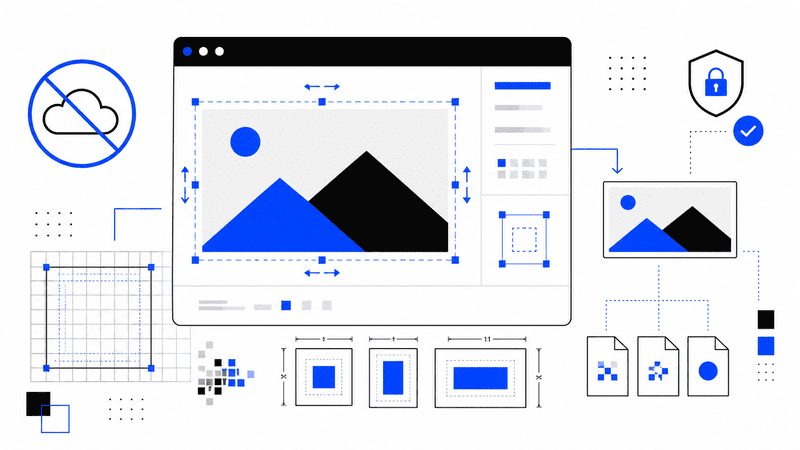

Resizing an image sounds like a simple task.

In reality, many online image editors require you to upload your files to a remote server before
anything happens. That may be acceptable for public images, but it is less appealing when you're
working with personal photos, client assets, internal documents, or screenshots containing sensitive
information.

Fortunately, modern browsers can resize images entirely on your own device.

No uploads. No waiting for a server. No unnecessary privacy concerns.

In this guide, you'll learn how local image resizing works, why it is often the better option, and
when you should choose browser-based processing over cloud services.

## Why Avoid Uploading Images?

Every uploaded file leaves your computer.

Even if a service promises to delete images after processing, your file still travels across the
internet and is temporarily stored somewhere before you download the result.

For many situations, that isn't ideal.

Examples include:

- Personal photographs
- Business presentations
- Design mockups
- Legal documents
- Medical records
- Screenshots containing passwords or API keys
- Internal company dashboards

Keeping these files on your own device reduces unnecessary exposure.

## Modern Browsers Can Resize Images

Today's browsers include powerful graphics APIs that allow websites to edit images locally.

The typical workflow looks like this:

1. Select an image from your computer.
2. The browser reads the file.
3. The image is decoded locally.
4. A canvas resizes the image.
5. The browser generates a new file.
6. You download the resized version.

Nothing needs to leave your computer.

This process works entirely inside the browser.

## How Local Image Resizing Works

Most browser-based image resizers rely on a few built-in web technologies.

### File API

The File API allows a web page to access files that you explicitly choose.

The website cannot browse your computer or read arbitrary folders.

You remain in control of which images are opened.

### Canvas API

The Canvas API creates a drawing surface inside the browser.

Once an image has been loaded, it can be drawn at almost any dimensions.

For example, a 4000 × 3000 photo can be rendered as:

- 2000 × 1500
- 1200 × 900
- 800 × 600
- 300 × 225

The browser performs the scaling locally.

### Blob API

After resizing, the canvas exports a completely new image.

Depending on the tool, you can usually save as:

- JPEG
- PNG
- WebP

Many editors also allow you to adjust JPEG quality before exporting.

## Benefits of Local Processing

### Better Privacy

Your files never need to be uploaded.

That alone makes browser-based tools attractive for anyone handling sensitive information.

### Faster Processing

Uploading a 25 MB photo over a slow connection can take much longer than resizing it locally.

Local processing begins almost immediately.

### Works Offline

Many browser-based image resizers continue working without an internet connection after the page has
loaded.

This can be useful while traveling or working in secure environments.

### No Server Limits

Cloud services often restrict:

- File size
- Daily uploads
- Number of conversions
- Export resolution

A local tool typically depends only on your device's available memory and processing power.

## When Local Resizing Is the Better Choice

Local processing is ideal for:

- Social media graphics
- Blog images
- Website optimization
- Product photos
- Portfolio images
- Email attachments
- Documentation
- Screenshots

If your goal is simply changing image dimensions or reducing file size, there is usually no reason
to involve a server.

## Resize by Pixels or Percentage

Most image resizers provide two approaches.

### Resize by Dimensions

Specify an exact width and height.

Examples:

```text
1920 × 1080
1200 × 630
1080 × 1350
800 × 800
```

This is useful for websites, social media, and UI assets.

### Resize by Percentage

Instead of entering new dimensions, reduce the image proportionally.

Examples:

```text
100%
75%
50%
25%
```

This approach is convenient when creating smaller versions without calculating pixel values.

## Keep the Aspect Ratio

Most resizing tools include an option to lock the aspect ratio.

This prevents the image from becoming stretched.

For example:

Original:

```text
4000 × 3000
```

Correct resize:

```text
2000 × 1500
```

Incorrect resize:

```text
2000 × 2000
```

Keeping the original proportions preserves the intended composition.

## Choose the Right Output Format

Different formats suit different content.

### JPEG

Best for:

- Photography
- Landscapes
- Portraits
- Large colorful images

JPEG produces relatively small files while maintaining good visual quality.

### PNG

Best for:

- Logos
- UI elements
- Screenshots
- Graphics with transparency

PNG preserves sharp edges and text.

### WebP

Best for:

- Modern websites
- Optimized web graphics

WebP often produces smaller files than JPEG or PNG while maintaining similar quality.

## Reduce File Size Without Losing Too Much Quality

Resizing dimensions already reduces file size significantly.

You can often reduce it even further by adjusting compression quality.

For JPEG images:

- 95% gives excellent quality.
- 90% is usually indistinguishable from the original.
- 80–85% provides an excellent balance between quality and file size.
- Below 70% compression artifacts become more noticeable.

Always preview the exported image before sharing it.

## Common Mistakes

### Upscaling Tiny Images

Increasing resolution does not create missing detail.

A 300 × 300 image enlarged to 3000 × 3000 will simply become blurrier.

### Ignoring Aspect Ratio

Stretching images makes people and objects look distorted.

Keep proportions locked unless distortion is intentional.

### Using PNG for Every Photo

PNG files are much larger than JPEG for photographic content.

Choose the format based on the image.

### Compressing Multiple Times

Saving an already compressed JPEG repeatedly can gradually reduce quality.

Whenever possible, start from the original file.

## Is Browser-Based Resizing Safe?

Local processing is generally safer than uploading files to an unknown server because the image
never needs to leave your device.

However, you should still use reputable tools.

A trustworthy image resizer should:

- Clearly explain that processing happens locally.
- Request only the files you select.
- Avoid unnecessary account creation.
- Not require uploads for basic resizing.

Privacy begins with understanding where your files are processed.

## Who Benefits Most?

Local image resizing is useful for almost everyone, including:

- Web developers
- Designers
- Content creators
- Bloggers
- Marketing teams
- Students
- Small businesses
- Photographers

If you regularly prepare images for websites or social media, local resizing can save both time and
bandwidth.

## Final Thoughts

You no longer need to upload every image to an online service just to change its dimensions.

Modern browsers include everything required to resize images locally using built-in web
technologies. The process is fast, private, and often works even without an internet connection.

For everyday tasks like preparing blog images, compressing photos for email, or creating graphics
for social media, browser-based resizing is usually the simplest solution.

Whenever possible, keep your files on your own device, resize them locally, and upload only the
final version you actually intend to share.
